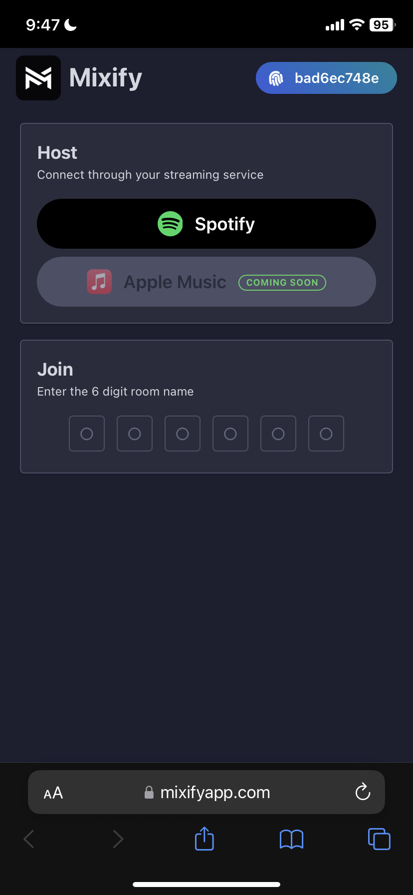
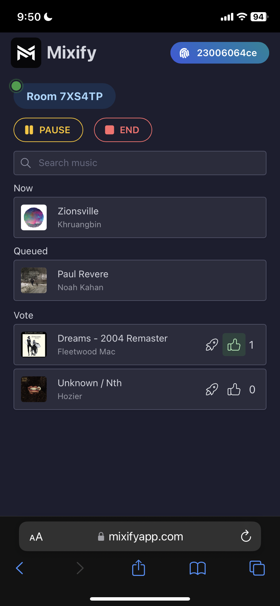
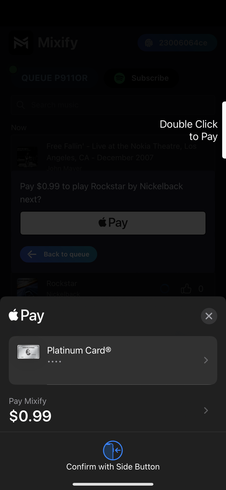

  

# Mixify

A crowdsourced music app that lets anyone add songs to a host's streaming service queue from their own devices. Finally, everyone can be on aux.

#### ⚡ Connect instantly through your streaming service.

#### 🔊 Anyone can add songs to your queue. Songs with the most upvotes are played next.

#### 🚀 Pay $0.99 to boost a song to the top. 50¢ of all payments go to the host.

